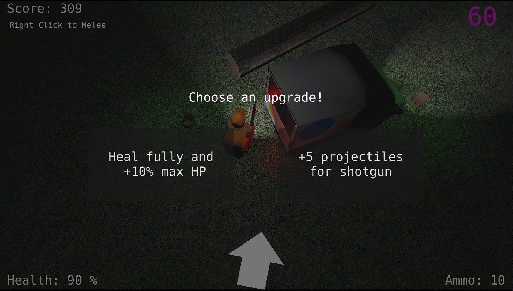
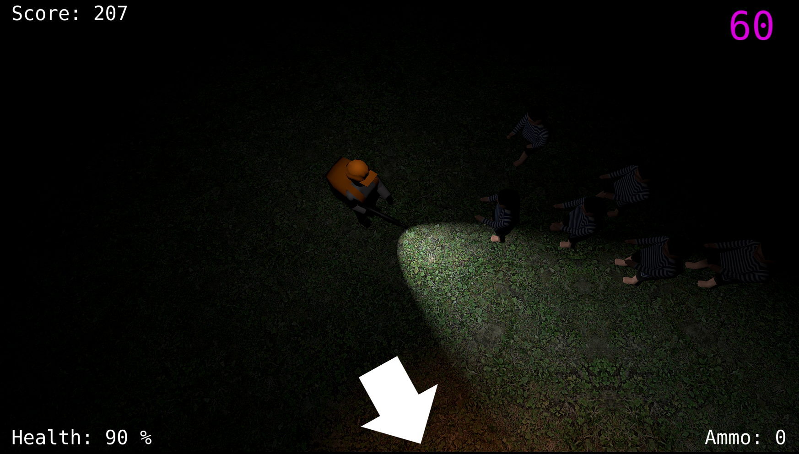

# Drop Dead Delivery

Drop Dead Delivery is a game made during Ludum Dare 53 game jam event. The game
is available for free in [itch.io](https://martta.itch.io/drop-dead-delivery). 

### Controls

- **WASD:** Move
- **Left-click:** Shoot
- **Righ-click:** Melee
- **Alt:** Roll
- **Space:** Jump

### About the game

> **"Neither snow, nor rain, nor heat, nor gloom of night stays these couriers from the swift completion of their appointed rounds"** - Motto of US postal service

...but in this game, you'll have to add **"ghouls"** to the list! Lucky for you, you're packing some serious heat in the form of **a shotgun.** So, don't be afraid to let loose a few rounds and show those spooky specters who's boss.

> **"There's some kind of dark symbiosis between lunatics and the Postal Service."** - Don Novello

Embrace your inner lunatic and get ready to show those ghouls who's boss!

With each successful **delivery**, you'll earn more points and **unlock new power ups** that will boost your abilities. But don't let the pressure get to you. Stay cool, keep your aim true, and remember that you're a package **delivery** machine!

So, what are you waiting for? Grab your mailbag, load up your shotgun, and get going!

Post jam updates: Web-release, security fixes for highscore table and bug fixes (see github for details)

Starting area with few ghould approaching

Luckily the ghouls dont know how to climb a tree

There are upgrades!

Making a delivery...

Such darkness...
